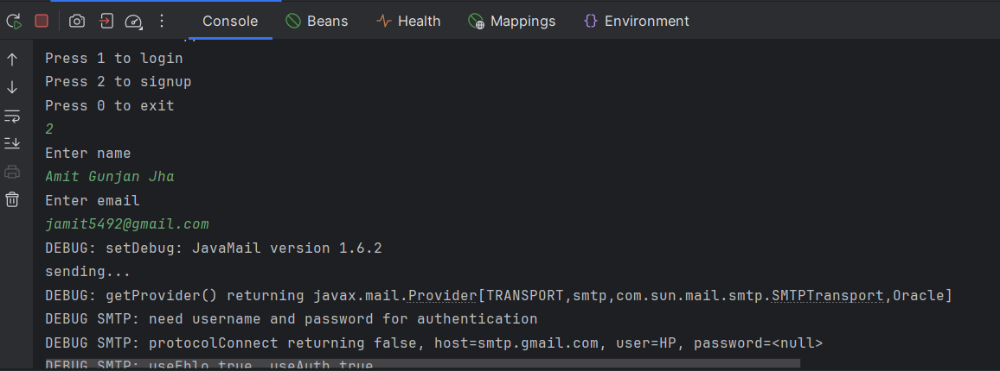
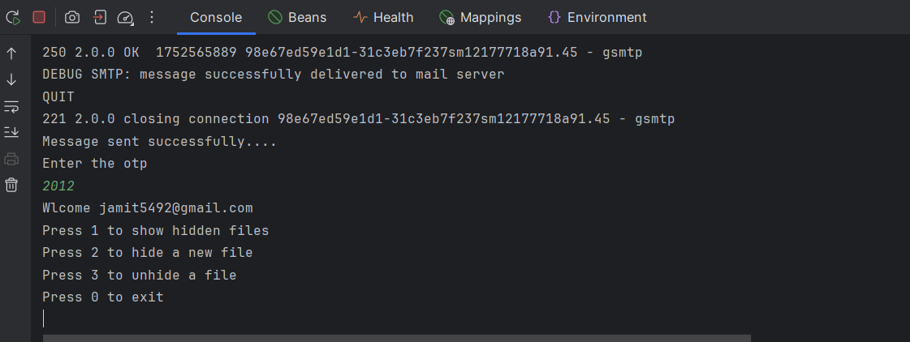
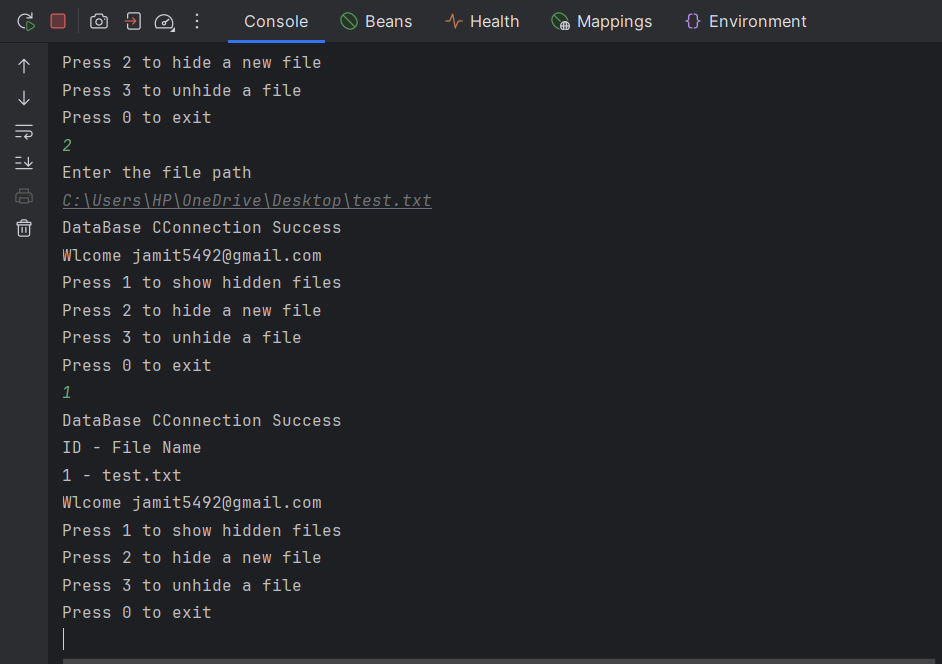

# File Cloak 📂🔐


A simple yet powerful command-line application built in Java to securely hide and unhide your files. This application ensures that your sensitive files are kept private with a user authentication system that features OTP (One-Time Password) verification via email.

## ✨ Features

*   **Secure User Authentication**: A robust login and signup system to ensure data privacy.
*   **Email OTP Verification**: New user signups are verified using a one-time password sent to the user's email address, preventing unauthorized account creation.
*   **File Hiding**: Securely hide any file from your file system. The application makes the file inaccessible until it is explicitly unhidden.
*   **File Unhiding**: Restore hidden files to their original state and location.
*   **Hidden File Management**: Easily view a list of all the files you have hidden.
*   **Database Integration**: Persistently stores user and file information.
*   **Interactive CLI**: A user-friendly command-line interface for easy navigation and operation.

## 📸 Screenshots

Here’s a walkthrough of the application's core functionalities.

### 1. User Registration & OTP Verification

New users can sign up with their name and email. An OTP is sent to their email to verify their identity and complete the registration.


*User enters name and email in the console*

<br/>


*User receives the OTP in their email inbox*

<br/>


*User enters the OTP in the console to complete verification*


### 2. Hiding a File

Once logged in, users can hide a file by providing its full path. The file is then added to the list of hidden files.


*User selects the option to hide a file and enters the path*


### 3. Viewing & Unhiding a File

Users can view all their hidden files and choose to unhide any of them by selecting its ID.


[Unhiding a File](images/unhide.png)
*User lists hidden files and then selects the option to unhide one*


## 🛠️ Technologies Used

*   **Java**: Core programming language.
*   **JDBC (Java Database Connectivity)**: For connecting to and interacting with the database.
*   **JavaMail API**: For sending OTP verification emails.

## 🚀 Getting Started

Follow these instructions to get a copy of the project up and running on your local machine.

### Prerequisites

*   Java Development Kit (JDK) 8 or higher.
*   An IDE that supports Java, such as IntelliJ IDEA or Eclipse.
*   Access to a database and the corresponding JDBC driver.

### Installation

1.  **Clone the repository:**
    ```sh
    git clone https://github.com/imjhaji03/File-Cloak.git
    ```
    *(Note: You will need to rename your repository on GitHub for this link to work.)*

2.  **Open the project** in your favorite Java IDE.
3.  **Configure the Database**:
    *   Locate the database configuration file/class.
    *   Update the database URL, username, and password to match your local setup.
4.  **Configure Email Service**:
    *   Locate the email configuration.
    *   Enter your email address and password to be used for sending OTPs. (It is highly recommended to use an "App Password" if you are using Gmail for security reasons).
5.  **Build and Run**:
    *   Run the `FileCloakApplication` main class to start the application. *(Note: Remember to rename your main class from `FileEncrypterApplication` to `FileCloakApplication`)*.

## 📖 How to Use

1.  **Start the application.** You will be presented with the main menu:
    *   `Press 1 to Login`
    *   `Press 2 to Signup`
    *   `Press 0 to exit`
2.  **Sign Up (First-time users):**
    *   Select option `2`.
    *   Enter your name and email.
    *   Check your email for an OTP and enter it in the console.
3.  **Login:**
    *   Select option `1`.
    *   Enter your registered email and password.
4.  **Main Menu (After Login):**
    *   `Press 1 to show hidden files`
    *   `Press 2 to hide a new file`
    *   `Press 3 to unhide a file`
    *   `Press 0 to exit`
5.  **Follow the on-screen prompts** to manage your files.

---
# File-Cloak
